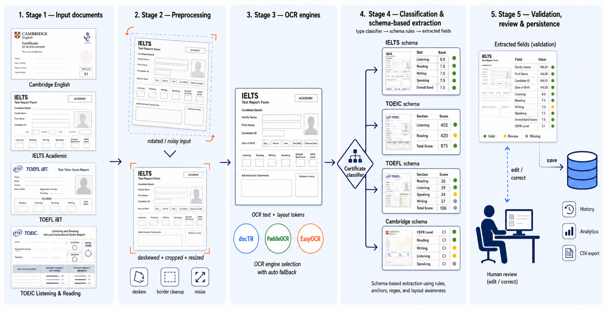
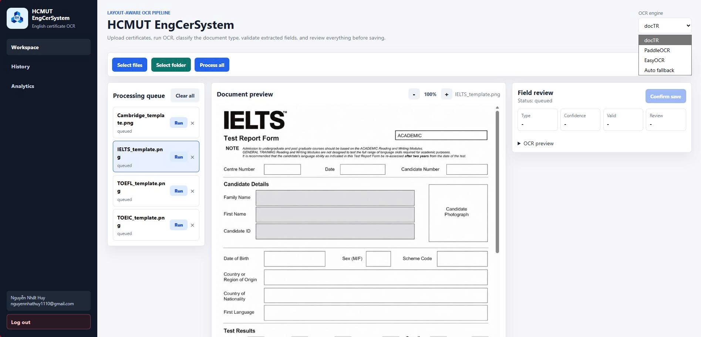
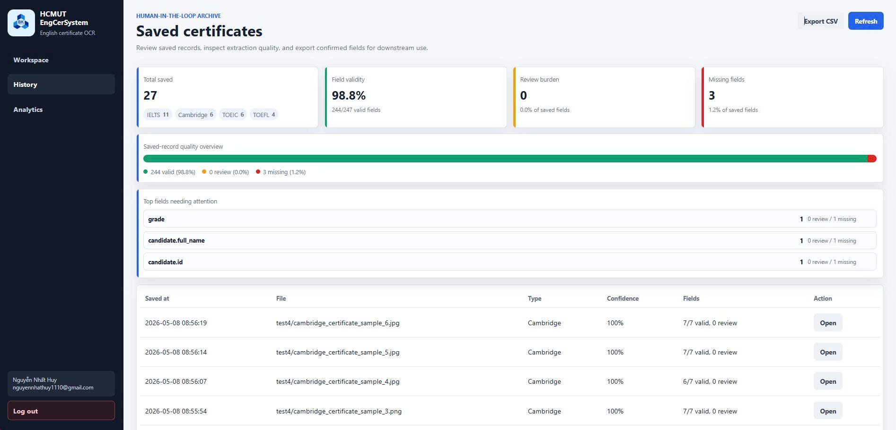
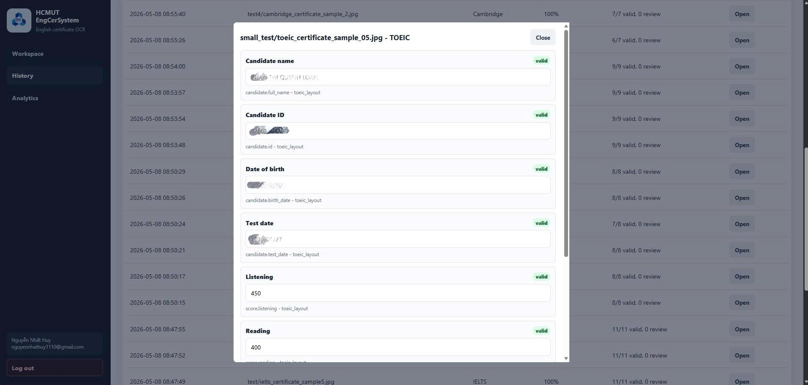
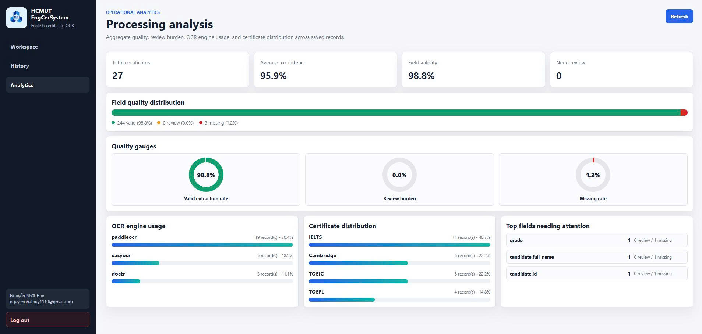
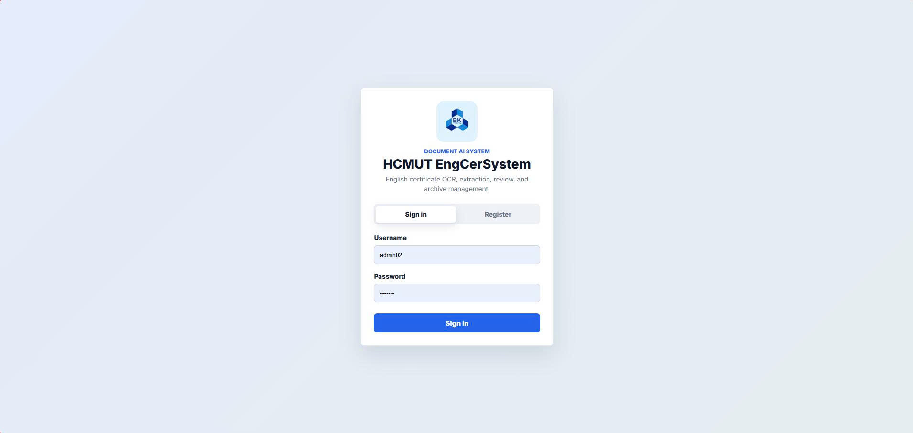
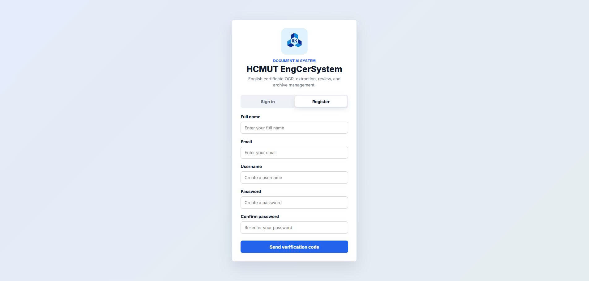

# HCMUT EngCerSystem

**HCMUT EngCerSystem** is an end-to-end Document AI system for recognizing, classifying, extracting, validating, reviewing, and archiving information from English language certificates. It was developed as a graduation project at Ho Chi Minh City University of Technology, VNU-HCM, and has been brought into practical experimental use as part of the HCMUT certificate digitization workflow.

The public repository contains the application source code and non-sensitive visual assets only. Real certificate samples, benchmark annotations, OCR predictions, saved database records, and evaluation outputs are intentionally excluded to protect personal and certificate information.



## Why This Project Matters

English certificates are still commonly handled through manual inspection and data entry in academic and administrative workflows. Staff often need to read certificate images or PDF files, identify the certificate type, transcribe candidate information, verify scores, and store the result for later lookup. This is slow, repetitive, and error-prone.

HCMUT EngCerSystem turns that workflow into a review-oriented Document AI application. The system does not treat OCR as the final answer. Instead, OCR is only one stage in a larger pipeline that combines preprocessing, OCR, certificate classification, schema-aware extraction, validation, human review, persistence, analytics, and CSV export.

## Key Features

- Recognizes four certificate families: IELTS, TOEIC, TOEFL iBT, and Cambridge English.
- Accepts JPG, JPEG, PNG, and first-page PDF inputs.
- Supports docTR, PaddleOCR, EasyOCR, and automatic OCR fallback.
- Applies practical image preprocessing: border cleanup, deskewing, and resizing.
- Classifies certificate type using interpretable keyword, regex, and layout signals.
- Extracts structured fields using schema definitions, anchors, regex rules, OCR line grouping, and certificate-specific layout logic.
- Validates extracted fields with score ranges, date checks, consistency checks, missing-field detection, and low-confidence warnings.
- Provides a human-in-the-loop web interface for review and correction before saving.
- Stores confirmed records in SQLite and supports history browsing, editing, deletion, analytics, and CSV export.

## Practical Deployment Context

This project was built as a real graduation project, not just a notebook prototype. The implementation includes:

- a Flask backend with authentication, session handling, processing APIs, storage, analytics, and export;
- a browser-based workspace for upload, OCR engine selection, field review, and saved-record management;
- a modular OCR layer that can compare or swap OCR engines without rewriting the full pipeline;
- a benchmark and evaluation workflow used privately during development and reporting.

The system is designed for administrative certificate digitization scenarios where correctness matters. For that reason, it emphasizes validation and human confirmation instead of silently accepting uncertain OCR output.

## System Screenshots

The application includes authentication, upload, review, saved-history, editing, and analytics views. The screenshots below are included to show the implemented workflow end to end.

### Processing Workspace



### Saved Records and Manual Editing

| History | Field correction |
| --- | --- |
|  |  |

### Operational Analytics



### Authentication Flow

| Login | Registration |
| --- | --- |
|  |  |

## Research Results

The system was evaluated privately on **EnglishCert-110**, a manually annotated benchmark containing 110 certificate samples and 1030 field-level annotations. The benchmark is not included in this public repository because it contains real certificate content and manually verified field values.

### OCR Engine Comparison

| OCR engine | Samples | Closed-set classification | Field accuracy | Avg. processing time |
| --- | ---: | ---: | ---: | ---: |
| docTR | 110 | 100.00% | 90.87% | 7.95s |
| PaddleOCR | 110 | 100.00% | 87.96% | 6.02s |
| EasyOCR | 110 | 100.00% | 41.36% | 8.72s |

The reported classification result is a closed-set result over IELTS, TOEIC, TOEFL iBT, and Cambridge English. It should not be interpreted as unrestricted robustness against arbitrary documents.

### Field Accuracy by Certificate Type

| OCR engine | IELTS | TOEIC | TOEFL iBT | Cambridge |
| --- | ---: | ---: | ---: | ---: |
| docTR | 90.18% | 93.75% | 85.19% | 95.24% |
| PaddleOCR | 90.73% | 90.00% | 73.33% | 87.62% |
| EasyOCR | 29.82% | 76.67% | 20.00% | 48.57% |

The strongest overall configuration in the private benchmark is docTR, while PaddleOCR provides a strong speed-accuracy trade-off. EasyOCR remains useful as a baseline but is less reliable for this certificate extraction task.

## Processing Pipeline

```text
Upload image/PDF
-> Decode image or render first PDF page
-> Preprocess document image
-> Run OCR
-> Classify certificate type
-> Select certificate schema
-> Extract structured fields
-> Validate values and assign review states
-> Human review and correction
-> Save confirmed record
-> Analyze, edit, delete, or export saved records
```

## Target Fields

| Certificate type | Main extracted fields |
| --- | --- |
| IELTS | Candidate name, candidate ID, test date, listening, reading, writing, speaking, overall band, CEFR level, TRF number, issuer |
| TOEIC | Candidate name, candidate ID, birth date, test date, listening, reading, total score, issuer |
| TOEFL iBT | Candidate name, registration or appointment number, test date, reading, listening, speaking, writing, total score, issuer |
| Cambridge English | Candidate name, issue or test date, CEFR level, overall score, grade, certificate number, issuer |

## Repository Structure

```text
EnglishCerProject/
├── asset/
│   ├── demo/              # non-sensitive UI screenshots for documentation
│   ├── figure/            # architecture and pipeline figures
│   └── logo/
├── backend/
│   ├── core/              # preprocessing, classification, pipeline orchestration
│   ├── extraction/        # field schemas and certificate-specific extraction rules
│   ├── ocr/               # docTR, PaddleOCR, EasyOCR adapters
│   ├── validation/        # validation rules and quality summaries
│   └── server.py          # Flask app, auth, APIs, persistence, analytics, export
├── frontend/
│   ├── auth.html
│   ├── index.html
│   ├── auth.js
│   ├── main.js
│   └── styles.css
├── scripts/
│   ├── prepare_benchmark.py
│   ├── run_benchmark_predictions.py
│   ├── evaluate_benchmark_ground_truth.py
│   ├── generate_report_assets.py
│   ├── generate_research_plots.py
│   └── generate_dataset_donut_figure.py
├── .env.example
├── .gitignore
└── README.md
```

## Installation

Python 3.10 or 3.11 is recommended.

```bash
python -m venv venv
```

Windows PowerShell:

```powershell
.\venv\Scripts\Activate.ps1
python -m pip install --upgrade pip
python -m pip install -r backend\requirements.txt
```

Linux or macOS:

```bash
source venv/bin/activate
python -m pip install --upgrade pip
python -m pip install -r backend/requirements.txt
```

Create a local environment file:

```bash
cp .env.example .env
```

Windows PowerShell:

```powershell
Copy-Item .env.example .env
```

## Configuration

```env
SECRET_KEY=change-me
DATABASE_URL=sqlite:///certificates.db
OCR_ENGINE=doctr
EMAIL_SENDER=YOUR_GMAIL@gmail.com
EMAIL_PASSWORD=YOUR_APP_PASSWORD
```

If email credentials are not configured, the backend runs in development OTP mode for local testing. In that mode, OTP values are returned for debugging instead of being sent through a production email service.

Supported OCR engine values:

```text
doctr
paddleocr
easyocr
auto
```

## Running the Application

From the project root:

```bash
python backend/server.py
```

Open the authentication page:

```text
http://localhost:8000/
```

After login, open the workspace:

```text
http://localhost:8000/app
```

## Main API Endpoints

| Method | Endpoint | Purpose |
| --- | --- | --- |
| POST | `/api/register-step1` | Create an unverified account and send OTP |
| POST | `/api/register-verify` | Verify account with OTP |
| POST | `/api/login` | Start a session |
| POST | `/api/logout` | End the session |
| GET | `/api/session` | Check authentication state |
| POST | `/api/process` | Run preprocessing, OCR, classification, extraction, and validation |
| POST | `/api/confirm` | Save a reviewed certificate |
| GET | `/api/my-certificates` | List saved certificate records |
| GET | `/api/get-certificate/<id>` | Load one saved record |
| PUT | `/api/update-certificate/<id>` | Update a saved payload |
| DELETE | `/api/delete-certificate/<id>` | Delete a saved record |
| GET | `/api/analytics` | Return saved-record analytics |
| GET | `/api/history-analysis` | Return field-quality analysis for saved records |
| GET | `/api/export-certificates.csv` | Export confirmed records as CSV |

## Data Privacy and Security

Certificate data is sensitive. A certificate image may contain names, candidate IDs, test dates, scores, certificate numbers, issuer details, and other personally identifiable information. For that reason, the public repository follows a privacy-first release policy:

- Real certificate images are not committed.
- The private benchmark folder is not committed.
- Ground-truth annotations are not committed.
- OCR predictions, extracted text, field mismatches, and field-level metrics are not committed.
- SQLite databases, uploads, logs, caches, environment files, and local evaluation outputs are ignored.
- Public assets are limited to source code, configuration examples, logos, pipeline diagrams, and non-sensitive documentation material.

The system itself is also designed around a human-in-the-loop principle. Extracted values are validated and surfaced with field status labels such as valid, review, and missing, so users can inspect and correct results before records are persisted.

## Benchmark Reproducibility

The scripts under `scripts/` are kept so the private evaluation workflow remains reproducible for authorized users. To reproduce the benchmark, place a private dataset in the expected internal structure and run:

```bash
python scripts/prepare_benchmark.py --data-dir ../Data_ĐACN --out-dir benchmark
python scripts/run_benchmark_predictions.py --engine doctr --out-dir benchmark/predictions --ground-truth benchmark/ground_truth_template.csv
python scripts/evaluate_benchmark_ground_truth.py --sample-predictions benchmark/predictions/samples_doctr.csv --field-predictions benchmark/predictions/fields_prefill_doctr.csv --out-dir benchmark/metrics_doctr
```

For any public reproduction, use anonymized or synthetic certificate images only.

## Limitations

- The extraction layer is intentionally interpretable and rule-based, so unseen layouts may require rule updates.
- The current PDF path processes the first page only.
- SQLite is suitable for local and prototype deployment, not high-concurrency production deployment.
- OTP handling is appropriate for a project prototype and should be hardened before production use.
- Robustness tests under blur, rotation, compression, contrast shift, and noise are future work.

## Author

Nguyen Nhat Huy  
Ho Chi Minh City University of Technology, VNU-HCM
